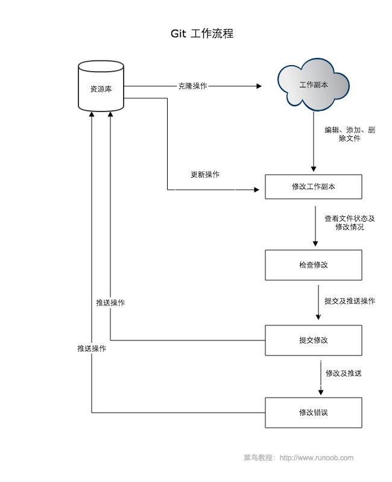

<!-- https://docs.github.com/cn/authentication/connecting-to-github-with-ssh/ -->
# git配置ssh
* 配置ssh也可到github上查看官方文档  
* https://docs.github.com/cn/authentication/connecting-to-github-with-ssh/
* ## shh介绍
> 没啥好说的
## 1. ssh-keygen生成加/解密算法
windows打开wsl或powershell或git或cmd都可以使用此命令
```
ssh-keygen -t ed25519 -C "your_email@example.com"
```
$\qquad\qquad$在`your_email@example.com`的位置输入你的邮箱  ,不是你的邮箱应该也没问题,不过我没试过   
$\qquad\qquad$输入以上名命令后,你可能看到很哈人的结果,不过不要慌  
$\qquad\qquad$你可能看到的结果:  
$\qquad$ (1)文件
```
    Generating public/private ed25519 key pair.
    Enter file in which to save the key (路径 id_ed25519): 
```
$\qquad\qquad$此处输入要生成的密钥的文件的名字及路径如:"/home/username/.ssh/miyao" 推荐加上路径,  
$\qquad\qquad$(注意windows下是" \ ",wsl及git_bash下是" / ")  
$\qquad\qquad$若什么都不输入则生成的文件应该是在当前目录下    
$\qquad\qquad$可以终端输入`pwd`查看当前目录  
$\qquad$ (2)  
```
    Enter passphrase (empty for no passphrase):
```
$\qquad\qquad$此处可以什么都不输入  
$\qquad\qquad$完成后会生成两个文件:如输入的为miyao,则生成`miyao`和`miyao_pub`两个文件(两个文件都可以用记事本打开)
## 2.添加密钥到你的账户
  进入
  https://github.com/settings/keys  
  将生成的 miyao_pub公钥中所有的内容复制粘贴到上面就行了
# git
   
虽然可能看不懂但我还是先贴在这里了

## 基本概念

我们先来理解下 Git 工作区、暂存区和版本库概念：
* 工作区：就是你在电脑里能看到的目录。
* 暂存区：英文叫 stage 或 index。一般存放在 .git 目录下的 index 文件（.git/index）中，所以我们把暂存区有时也叫作索引（index）。
* 版本库：工作区有一个隐藏目录 .git，这个不算工作区，而是 Git 的版本库。


## 基本命令:  
### 1.在工作区初始化仓库
```sh
cd <工作区> #先进入工作区目录
git init #初始化仓库
```
$\qquad$也可以直接指定工作区路径
```sh
git init newrepo #其中newrepo为工作区目录,如:git init /home/user/testcode/
```
$\qquad$ 初始化本地仓库后可以查看本地库状态
```
git status
```
### 2.添加文件到暂存区
```sh
git add <file> #<file>为工作区的文件
```
```sh
git rm --cached <file>#将文件从暂存区删除,<file>为要删除的文件
```
`git rm --cached <file>`命令只会将文件从暂存区移除,不会实际删除,换句话说，仅是从跟踪清单中删除
$\qquad$此时可以查看提交记录
```
git log
git blame <指定文件名>
```
$\qquad$输入q关闭
### 3.提交本地库
```
git commit -m "提交说明"
```
  
$\qquad$此处提交说明必须写  
$\qquad$此时提交是失败的,因为并没有设置本地的名字和邮箱,会提示你输入名字和邮箱  

$\qquad$可以看到提示的信息，按照此信息输入即可
```sh 
git config --global user.name '名字'
git config --global user.email "邮箱"
```
#### 如果不放心输入是否正确可查看配置文件(用记事本就能打开)：
windows路径：`C:\Users\用户名\.gitconfig`  
ubuntu和wsl路径：`/home/用户名/.gitconfig`  
请注意wsl和windows的分隔符不同

### 4.提交远程库:
```
git push <远程仓库地址,这里用的是ssh协议> <分支名称,如:master>
```
$\qquad$仓库地址很长,push时不是很方便,因此,可以设置仓库简称
代码示例:
```sh
git remote add <简称> <远程库地址>  #设置简称
git push <简称> master  #提交
```
### 5.分支管理
* 创建分支：
```sh
git branch (branchname) #分支名:如上面提到的master,
```
* 切换分支:
```
git checkout (branchname)
```
* 合并分支
```
git merge 
```
* 删除分支
```
git branch -d <分支名>
```

## 其他
* git也有图形化客户端和第三方的客户端,也可以使用ide的插件,有兴趣可尝试一下
