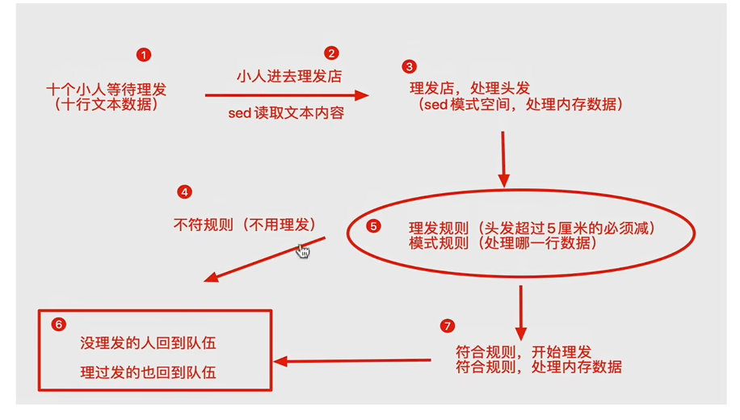

# 一.sed
* ## sed 的内置命令
| 参数   | 解释   | 用法|
| :----- | ----: | ----: | 
| a | append |对文本追加,在指定的行后追加一行或多行文字     | 
| d | delete |删除匹配行      |
| i | insert |对文本插入,在指定的行前追加一行或多行文字     | 
| p | print  |将匹配行输出 | 
|s/正则/要替换的内容/g| sub和global| 将正则替换为指定的内容|  
 * ##   sed对单个文件处理的区间
| 范围   | 解释  |                                                 实例 |
| :-----| ----: | :----: |
| 空地址 | 如果没指定地址则表示全部          | sed "p" /home/aran/.bash_history  -n|
| 单地址 | 如果只制定1个数字,只输出此行      | sed "20p" /home/aran/.bash_history  -n |
| 区间   | 输出指定的行(区间)              | sed "1,20p" /home/aran/.bash_history  -n |
| 步长   | 1~2,表示1,3,5,7// 2~2表示2,4,6 | sed "1~20p" /home/aran/.bash_history  -n |

范围区间也可有`sed "1+20p" /home/aran/.bash_history  -n`表示从1开始后再加20行

* ## sed 的参数
| 参数   | 解释  |
| :-----| ----: | 
| -n | 取消sed的默认输出 ,常与内置命令p一起使用     | 
| -i | 直接将修改结果写入文件,如不使用,则sed只改内存      |
| -e |      代表多次编辑,即可以编辑多次        | 
| -r | 支持正则表达式 |

sed语法:  `sed "< <命令> >"   <文件名> <参数>`,其中参数的位置随意
<!-- ### $\qquad$.   `-n`参数
$\qquad$由于sed输出时默认会将匹配到的和没匹配到的一起输出,  
$\qquad$因此,需要`-n`参数将没有匹配到的删除
 -->

    
sed流程 

$\qquad$ sed 命令实例:
```sh
sed "2,3p" ./bash_history -n
sed "/1111/d" ./txt 
sed "/1111/d" ./txt -i #加 -i参数将修改结果写入文件 删除含1111的行
sed "s/$a/哦哦/g" ./txt #将 $a 的内容替换为 哦哦 如不加-i参数 则不写入文件,g表示应用于全局 
sed -e"s/$a/哦哦/g" -e "s/333/three three/" ./txt #-e编剧多次
sed "2 a 在第二行后加入了新的内容" ./txt
sed "a 在每行后加入新的内容" ./txt
for((i=1;i<5;i++))
do
    sed "$i a 在第$i行追加加了内容 " ./txt -i
done
```
<!-- $\qquad$结果会显示第一二行的内容 -->

